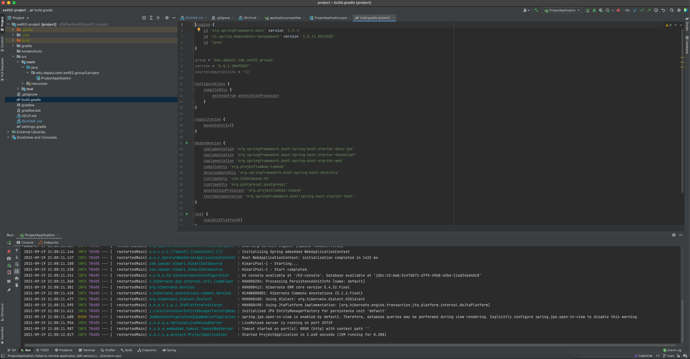

# se452-project

# Group Members
* Steven La
* Andrew Murphy
* Brandon Harrington
* Ana Vargas

# Questions
**Project scope area**
* Dog party is an application that will provide services to your dog. You can book a daily dog walker. Hire a dog sitter for a period time, and even book a dog walk party for a safe and social experience. Our website will make it easy for users to search, book, and review Dog party employees.

**Initial key features**
* Dog sitting
* Profile and Reviews
* Chat messaging
* Create/join dog party

**Github location**
* https://github.com/se452-group3/se452-project

**How conflicts will be resolved**
* Vote will be done and majority will decide the conflict
* Ties decided by rock-paper-scissors (best of 3)

**Communication mechanism**
* Slack and Zoom

**Meeting**
* Once a week

**Decision made (eg editor, project scope)**
* Any IDE that has git, VS code, Intellij

**Screen shot of working code (clean compile) in Appendix.**

